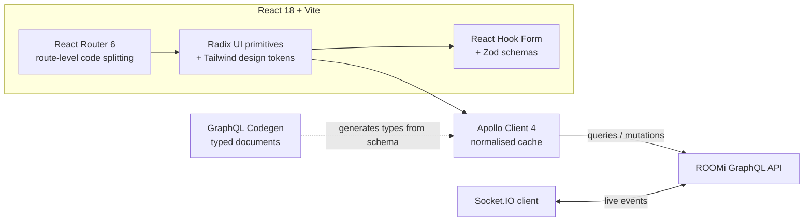

# ROOMi — Web Client

**React SPA for the ROOMi booking platform.** Property discovery and filtering, availability-aware booking flow, guest and agent dashboards, multilingual UI, and live notifications over WebSocket.


> API server: **[ROOMi-backend](https://github.com/myx-codes/ROOMi-backend)**

---

## About this project

The client half of ROOMi, a personal project built to practise the parts of frontend work that a component demo never reaches: a typed data layer that cannot drift from the API, filter state that belongs in the URL, forms with real validation, and a UI that stays correct when the server pushes changes underneath it.

It has not served production traffic. Everything below describes what is implemented in this repository.

---

## What it does

**Property discovery.** Search by location, date range, category, price band, minimum rating, and amenities. Filters compose into a single GraphQL query and update results without a page reload.

**Booking flow.** Date selection is checked against server-side availability before a reservation is submitted, so double bookings are rejected at the source rather than caught after the fact.

**Role-scoped dashboards.** Guests manage bookings, favourites, and profile. Agents manage listings, reservations, and earnings. Each area is gated by the role encoded in the session.

**Live notifications.** A Socket.IO connection delivers booking and status events as they happen.

**Internationalisation.** English, Korean, and Uzbek across navigation, listings, booking flows, and account pages, switchable without a reload.

---

## Architecture



**Typed data layer.** `graphql-codegen` reads the server schema and emits typed documents and hooks. A field renamed on the server becomes a compile error here, not a runtime `undefined` discovered by a user.

**Cache as state.** Apollo's normalised cache is the source of truth for server data, so a booking confirmed in one view updates every other view referencing it, without a separate global store.

**Accessible primitives.** UI is composed from Radix UI, which supplies keyboard navigation, focus management, and ARIA semantics for dialogs, menus, and form controls, styled with Tailwind rather than reimplemented.

**Validated forms.** React Hook Form with Zod resolvers keeps validation rules in one schema shared by the form and the type system.

---

## Tech stack

| Layer | Technologies |
|---|---|
| Framework | React 18, TypeScript 5.8 |
| Build | Vite 5, `@vitejs/plugin-react-swc` |
| Data | Apollo Client 4, GraphQL Codegen |
| Routing | React Router 6 |
| UI | Radix UI, Tailwind CSS 3.4, Lucide icons, Framer Motion |
| Forms | React Hook Form, Zod |
| Real-time | Socket.IO client |
| Charts | Recharts |
| Tooling | ESLint, TypeScript ESLint, PostCSS |

---

## Getting started

### Prerequisites

- Node.js 20+
- A running [ROOMi-backend](https://github.com/myx-codes/ROOMi-backend) instance

### Setup

```bash
git clone https://github.com/myx-codes/ROOMi-frontend.git
cd ROOMi-frontend
npm install
```

Create `.env` in the project root:

```
VITE_API_URL=http://localhost:3000/graphql
VITE_SOCKET_URL=http://localhost:3000
```

### Run

```bash
npm run dev        # development server
npm run codegen    # regenerate types after a schema change
npm run build      # production bundle
npm run preview    # serve the production build locally
npm run lint
```

Run `npm run codegen` whenever the backend schema changes — the generated types are committed and the build depends on them.

---

## Repository layout

```
src/
  components/    reusable UI, built on Radix primitives
  pages/         route-level views
  graphql/       queries, mutations, generated types
  hooks/         shared React hooks
  lib/           utilities and configuration
  locales/       en / ko / uz translation resources
codegen.yml      GraphQL Codegen configuration
```

---

## Author

**Mukhammadyusuf Kholbajonov** — Backend / Full-Stack Engineer
MSc Computer Engineering, Dongguk University, Seoul
[GitHub](https://github.com/myx-codes)
